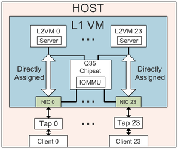

This is a repo for HypeSIO - **Hyper-tenant Simulator for I/O address translation** described in a paper:

> Alexey Lavrov and David Wentzlaff, ["HyperTRIO: Hyper-tenant Translation of I/O Addresses,"](https://www.iscaconf.org/isca2020/papers/466100a487.pdf) In Proceedings of the 47th International Symposium on Computer Architecture ([ISCA'20](https://www.iscaconf.org/isca2020/program/)).

<p align="center">
  
</p>


# Content of Readme:
[Overview](README.md#overview)

[Directory Structure](README.md#directory-stucture)

[Requirements](README.md#requirements)

[Dependencies](README.md#dependencies)

[Setup](README.md#configuration)

[Usage](README.md#usage)

# Overview
*HyperSIO* is a simulator for I/O address translations in hyper-tenant environments. It consists of three main parts:
1. *Log Collector* - runs QEMU with L1, L2, and client VMs and collects the IOMMU accesses logs.
2. *Trace Constructor* - reads in one or more logs generated at the previous step, and creates a single trace modeling a hyper-tenant setup.
3. *Trace-driven Performance Model* - given configured system parameters, a performance model uses a generated trace to evaluate a maximum achievable I/O link utilization.
A detailed description of *HyperSIO* can be found in the [HyperTRIO paper](https://www.iscaconf.org/isca2020/papers/466100a487.pdf).

# Directory Structure

* *build/* - directory for storing temporary logs, VM images, and any other files generated by tools
* *docs/* - detailed tool description used to HyperSIO
* *src/* - a folder with the source code for tools and scripts
* *src/lib/* - python libraries used by various tools and scripts
* *src/scripts/* - scripts for manipulating VMs, configuring VMs, and building QEMU
* *src/tools/* - Python tools for collecting logs, generating traces, launching performance simulations, and controlling VMs
* *src/sioperf/* - directory containing C++ tool `hypersio-perf` and its source code
* *src/trace_events* - a file with QEMU events logged from an L1 VM

# Requirements
1. **`sudo` access to a host machine.**
To make simulation runtimes feasible, we launch the L1 VM with KVM support. This option requires `sudo` access on the host.
2. **At least 512GB available disk space.** HyperSIO runs a system where an L1 VM has I/O devices, IOMMU, and L2 VMs. The latter requires at least 8 GB of disk space each. When using 24 I/O devices, it results in 8GB\*24=192GB available space on the L1 VM, resulting in around 200GB image file. Also, when running client VMs, each VM requires an additional 8GB per every client VM. Finally, some tests (*websearch*) need even more disk space, increasing an image of an L2 VM. 
3. **At least 32GB of main memory.** We tried to run L2 VMs, which had as few as 256MB of main memory. However, we suggest that the host machine has at least 128GB of memory, so every L2 VM and client are not limited by their main memory allocation.
4. **IPs 172.16.0.10/24 - 172.16.25.10/24 not used on the host.** *HyperSIO* uses these IPs for L2 VMs/clients, and in the case other interfaces have an IP in that range, *HyperSIO's* connections won't work.
5. **Python2.7** installed on a host. Current scripts were written for Python 2.7 and might not work with Python 3.

# Dependencies
1. *HyperSIO* uses QEMU for its *Log Collector* part. A script for downloading and configuring QEMU is described in the *Setup* section.
2. An Ubuntu ISO disk image used for OS installation on L1, L2, and client VMs. *vmwrapper* tool checks and downloads it if necessary, as described in the *Setup* section.

# Setup
1. After cloning the repo, run `source config.sh` in the root folder. This script sets `HYPERSIO_HOME` environment variable required by the tools and adds directories with scripts and tools to a system `PATH` variable.
2. Build QEMU by running `build_qemu.sh`. It downloads QEMU into *build/* directory then it applies a `src/scripts/qemu_patch.diff` patch, and finally, the script builds `x86_64-softmmu` target.
3. Create and configure an image for a client's L2 VM:
* Create an empty image by running `vmwrapper --vmtype l2 --action createbaseimage`
* Install OS on an L2 VM's image: `vmwrapper --vmtype l2 --action installos`. *vmwrapper* tool downloads Ubuntu 18.04.4 ISO into a *build* folder and uses it for OS installation. When prompted, enter a password to switch to a `sudo` user. During OS installation, a GUI window pops up, which requires X11 installed and configured on a host machine. You **_must specify hypersio as a username_**  when creating a user profile during the installation. You should check a box when asked to *Install OpenSSH server* and select *docker* when prompted to select popular snaps. All other configuration parameters can be set to their default values.
* After OS installation is done and a VM is rebooted, log in as *hypersio* user to the VM. If you quitted QEMU or closed a window after OS installation, you can re-launch it using `vmwrapper --vmtype l2 --action launch --graphic` command.
* When logged in as *hypersio* user, run the next command in a home directory:
```
git clone git@github.com:PrincetonUniversity/hypersio.git
cd hypersio/src/scripts
./config_l2_base
```
After you run this command, you'll receive the next prompts one after another:
- A prompt to enter a password for `hypersio` user to execute commands as a superuser
- A prompt for a file location to save `hypersio`'s ssh key. Press Enter to keep a default one
- A prompt to enter an ssh passphrase for `hypersio`. **Do not use an empty passphrase since your VM will be connected to the Internet! Make it secure!**
- A prompt to confirm an ssh passphrase for the `hypersio` user
- A prompt for a new password for the `root` user
- A prompt for `root`'s password confirmation
- A prompt for a file location for `root`'s ssh key. Press Enter to keep a default one
- A prompt to enter an ssh passphrase for the `root` user. **Do not use an empty passphrase since your VM will be connected to the Internet! Make it secure!**
- A prompt to confirm a passphrase for the `root` user
When script finishes, a VM will be powered off.

4. Follow the same procedure described at Step 3 to create an L1 VM and to configure it. Use `l1` instead of `l2` for `vmwrapper` option, and run `./config_l1_vm` after cloning a repo.

5. Copy L2 VM base image from a host to the L1 VM. Run the next command to launch the L1 VM with a shared folder: 
```
vmwrapper --vmtype l1 --action launchsharedfolder
```
This time boot log will be forwarded to your console. Log in into L1 VM as a `hypersio` user and enter a passphrase for an SSH agent. Then run a script `copy_l2_to_l1` to copy the L2 VM base image from a host to L1 VM. When script finishes, power off L1 VM by executing `sudo poweroff`.

6. Create a Client VM following the same steps as described for L2 VM. Use `client` instead of `l2` for `vmwrapper` option, and run `config_client_base` after cloning the repo.

7. Copy SSH IDs between VMs to be able to execute commands remotely.
- If you don't have a generated SSH key on a host machine, create one:
```
ssh-keygen
```
- Start L1 VM:
```
vmwrapper --vmtype l1 --action launch
```
- After L1 VM is running copy SSH ID from a host to L1 VM for both `root` and `hypersio` users:
```
vmwrapper --vmtype l1 --action copysshidall
```
- Copy SSH ID for `hypersio` and `root` from the L1 VM to the L2 VM. You can log in to the L1 VM in a console where it was started, or you can run `vmwrapper --vmtype l1 --action login` to login to L1 VM from a different console. When you log in to the L1 VM, run
```
vmwrapper --vmtype l2 --action launch
```
Wait until the L2 VM is up and running (it will have a login prompt in a console) and copy SSH ID from the L1 VM for `hypersio` and `root` users:
```
vmwrapper --vmtype l2 --action copysshidall
sudo su
vmwrapper --vmtype l2 --action copysshidall
```
Poweroff the L2 VM by executing `vmwrapper --vmtype l2 --action poweroff` on the L1 VM or by executing `poweroff` command directly on the L2 VM. When the L2 VM is powered off, poweroff the L1 VM by running `vmwrapper --vmtype l1 --action poweroff` on a host machine, or by executing `poweroff` command directly on the L1 VM.
- Copy SSH ID for both `hypersio` and `root` users on a Client VM from a host machine.

Start a Client VM:
```
vmwrapper --vmtype client --action launch
```
and when the VM is running, execute
```
vmwrapper --vmtype client --action copysshidall
```
Now power off a Client VM:
```
vmwrapper --vmtype client --action poweroff
```
Now you can execute commands from the host machine on the L1 VM and the Client VM, and from the L1 VM on the L2 VM.

8. Create L2 VMs for running tests from an L2 Base VM image.
- Launch the L1 VM:
```
vmwrapper --vmtype l1 --action launch
```
- Log into the L1 VM as the **`root`** user using either `vmwrapper --vmtype l1 --action login --username root` command or directly via an L1 VM console prompt. After that, run the next command:
```
vmwrapper --vmtype l2 --action preparevm --vmid 0
```
It copies the L2 Base VM image to a new image corresponding to an L2 VM with ID 0, launches the L2 VM 0, remotely runs configuration script on it, and powers off the L2 VM 0.
- Power off the L1 VM by running `poweroff` on the L1 VM directly or by executing `vmwrapper --vmtype l1 --action poweroff` on the host.

9. Create a Client VM from a Client Base VM image for running tests.
```
vmwrapper --vmtype client --action preparevm --vmid 0
```

10. Compile `hypersio-perf` tool in *src/sioperf* folder:
```
cd $HYPERIO_HOME/src/sioperf
make
```

After completing all configuration steps, you will have an environment for collecting QEMU logs for I/O address translations with one client and one server VMs. In case you want more client-server pairs for a particular test, you can specify multiple VM IDs for `vmwrapper` script when preparing Client/L2 VM images from the base ones.

# Usage

## Collecting QEMU log(s) of I/O address translations
A tool `hypersio-log-collector` collects I/O address translation log(s) from the L1 VM. Required arguments are a test name and the number of L2 VMs. For example, to run *iperf3* stress test for one client-server pair, execute the next command:
```
hypersio-log-collector --test iperf3 --l2vm 1
```
See more detailed `hypersio-log-collector` description in [its documentation](docs/hypersio_log_collector.md).

## Generating hyper-tenant trace

A tool `hypersio-trace-gen` generates hyper-tenant traces from logs collected by `hypersio-log-collector`. Required arguments are a test name, the total number of tenants in a trace, order between tenants, the number of consecutive packets from a single tenant - burst size, and a log group prefix. When the total number of tenants is greater than the number of tenants in a single log file, `hypersio-trace-gen` reads in multiple logs which have the same prefix.
For example, if we want to generate a trace with three tenants while we had only one client-server pair per `hypersio-log-collector` run, `hypersio-trace-gen` will read three logs, assuming that they all exist:
```
hypersio-trace-gen --benchmark iperf3 --tenants 3 --tenantorder rr --tenantburstpkt 1 --loggroupprefix hypersio_iperf3_vm_1_log
```
See more detailed `hypersio-trace-gen` description in [its documentation](docs/hypersio_trace_gen.md).

## Running performance model

A tool `hypersio-perf-explore` launches a performance simulation of hyper-tenant trace for one or more architectural configurations. At the end of the simulation it generates a log with statistics for various architecture modules and the maximum achievable I/O link utilization. First, the tool generates an architectural configuration file to *build/perf_config* folder, and next, it launches a `hypersio-perf` tool.
`hypersio-perf-explore` requires a benchmark name, the total number of tenants, tenant interleaving order, and the number of consecutive packets from a single tenant. The tool uses default configuration until it's changed via command line options or inside a tool. 
For example, to run `hypersio-perf-explore` for a trace generated by `hypersio-trance-gen` above, run the command:
```
hypersio-perf-explore --benchmark iperf3 --tenants 3 --tenantorder rr --tenantburstpkt 1
```
A corresponding `hypersio-perf` command which is invoked automatically for a default configuration:
```
$HYPERSIO_HOME/src/sioperf/hypersio-perf --run --config $HYPERSIO_HOME/build/perf_configs/iperf3_tnt_3_rr3_base_tq_1_ooo_iotlb_64_8_lru_l2_512_16_l3_1024_16_pref_0_2_32.cfg --prefix iperf3_tnt_3_rr3 --tqueue 1 --tenants 3 --iotlbrepl lru --linkbwgbps 200
```
`hypersio-perf-explore` allows to run multiple performance simulations of different architectural configurations in parallel for the trace. In necessary, `hypersio-perf` can be called directly.

See more detailed `hypersio-perf-explore` description in [its documentation](docs/hypersio_perf_explore.md).
